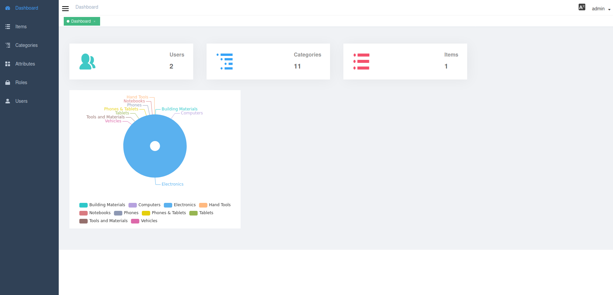

# vue2-listing-admin
Vue.js 2 based admin ui for listing-service

Set Listings service api in config/dev.env.js

``` bash
# install dependencies
npm install

# serve with hot reload at localhost:8080
npm run dev

# build for production with minification
npm run build:dev

# build for production and view the bundle analyzer report
npm run build --report
```

Users:
admin:admin
user:user




